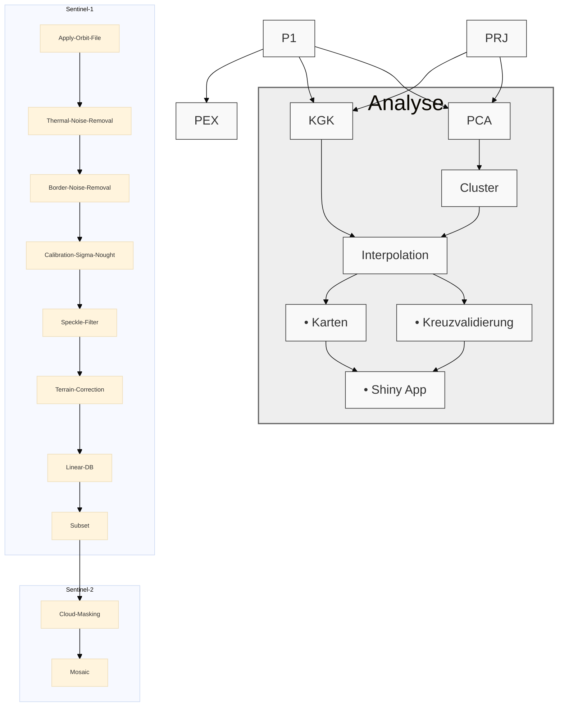

### Dokumentation of project "-" code and data

### Workflow

```mermaid
%%{init: {'theme': 'base', 'themeVariables': { 'fontSize': '10px', 'fontFamily': 'arial' }}}%%
graph TD
    %% Konfiguration für gerade/eckige Linien
    linkStyle default orthogonal

    %% S1-Subgraph
    subgraph Sentinel-1["Sentinel-1"]
        direction TD
        OAF["Apply-Orbit-File"] --> TNR["Thermal-Noise-Removal"]
        TNR --> BNR["Border-Noise-Removal"]
        BNR --> Cal["Calibration-Sigma-Nought"]
        Cal --> SPK["Speckle-Filter"]
        SPK --> TCR["Terrain-Correction"]
        TCR --> LDB["Linear-DB"]
        LDB --> SUB["Subset"]
    end

    %% Sentinel-2 Subgraph
    subgraph Sentinel-2["Sentinel-2"]
        direction TB
        SUB["Subset"] --> CLM["Cloud-Masking"]
        CLM --> MSC["Mosaic"]
    end

    %% Analyse Subgraph
    subgraph analyse["Analyse"]
        direction LR
        KR["KGK"] --> IN["Interpolation"]
        PC["PCA"] --> CL["Cluster"]
        CL --> IN
        IN --> Map["• Karten"]
        IN --> CV["• Kreuzvalidierung"]
        Map --> App["• Shiny App"]
        CV --> App
    end

    %% Verbindungen zwischen Subgraphs
    P1 --> PEX
    P1 --> KR
    P1 --> PC
    PRJ --> KR
    PRJ --> PC

    %% Stil- und Layoutoptimierungen
    classDef box fill:#f9f9f9,stroke:#333,stroke-width:1px,font-size:20px
    classDef subgraph_style fill:#eeeeee,stroke:#666,stroke-width:2px,font-size:35px
    class DWD,REMO,F1,N2R,PEX,DIF,PRJ,P1,KR,PC,CL,IN,Map,CV,App box
    class historisch,projektionen,analyse subgraph_style
```
